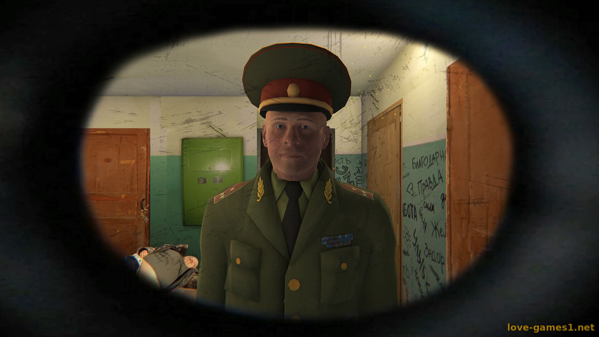

# Охота на студентов

Проект вдохнавлялся игрой __Симулятор побега от военкомата__

#Концепция
>Студент МАИ вплоть до сессии не готовился к матану. Во время просмотра телевизора происходит что-то странное и он проваливается в backrooms. Главаная задача:
Сбежать от преподавателя из лабиринта как можно быстрея

#Визуальный стиль
* Новелла переходящая в backrooms

#Базовые механики

* Управление от 1 лица
* ИИ врага(для обхода препятствий)
* простейшая диалоговая система в стиле визуальной новеллы

  
#Билд 
[Билд игры](https://disk.yandex.ru/d/rfYPsUN8hFZT8Q)

